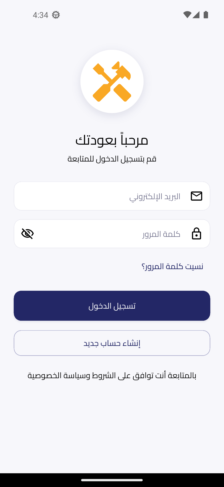
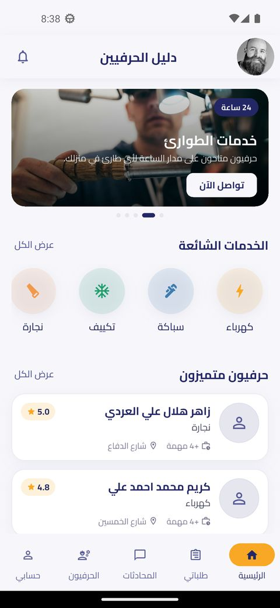
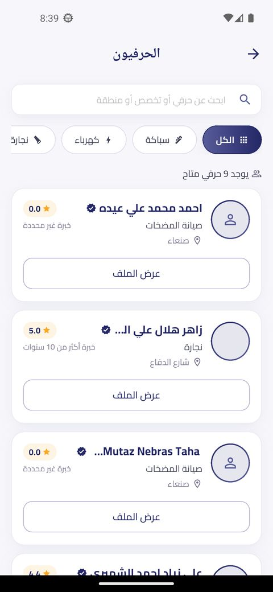
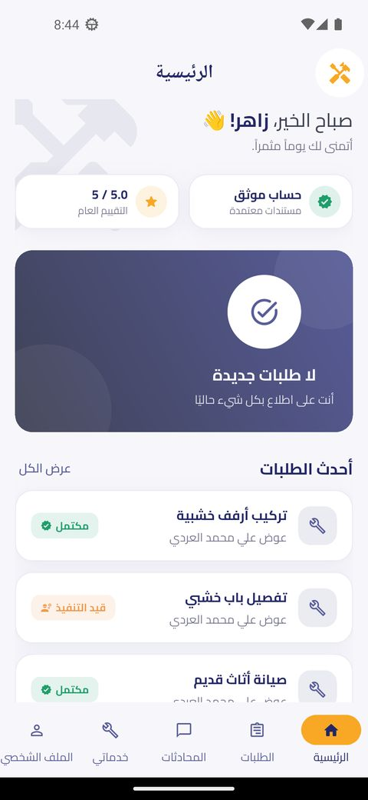
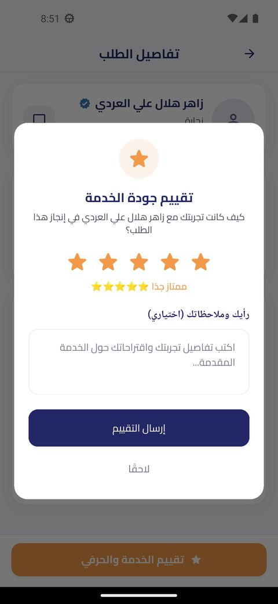
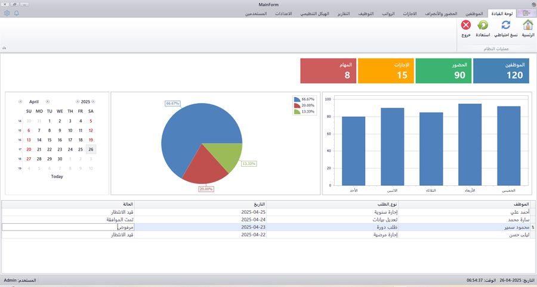
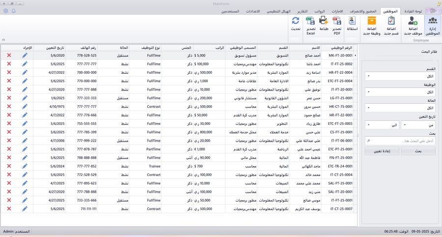
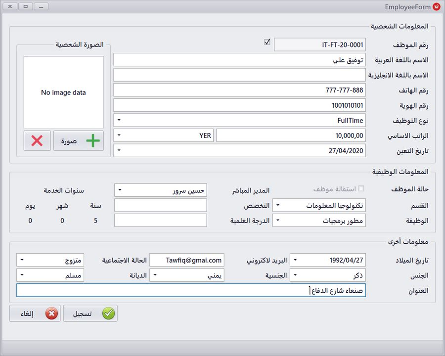
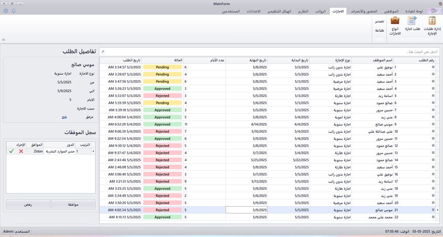

# Zidan Al-Hilali

**Junior Software Developer** — Mobile (Flutter) &amp; Desktop (C# / .NET)

Sana'a, Yemen — open to remote work · B.Sc. Information Technology, GPA 90% · 650+ programming problems solved

[Portfolio](https://zidanalhilali.netlify.app) &nbsp;·&nbsp; [Email](mailto:zidan3.dev@gmail.com) &nbsp;·&nbsp; [GitHub](https://github.com/zidanalhilali)

 

## About

I build full features end to end — requirements, UI design, implementation, and version control — rather than isolated functions. My foundation is object-oriented programming, data structures, and algorithms, and I've applied it to two shipped products: a real-time mobile marketplace and a desktop HR system.

 

## Toolset

<table>
<tr><td width="180"><strong>Mobile</strong></td><td>Flutter, Dart, Riverpod, Firebase Authentication, Cloud Firestore</td></tr>
<tr><td><strong>Desktop / Backend</strong></td><td>C#, .NET, Windows Forms, Entity Framework Core, SQL Server, LINQ</td></tr>
<tr><td><strong>Practices</strong></td><td>Clean Architecture, Feature-First structure, Repository pattern, Dependency Injection</td></tr>
<tr><td><strong>Foundations</strong></td><td>OOP, Data Structures &amp; Algorithms, SQL, Git / GitHub</td></tr>
</table>

 

## Experience

**Mobile App Development Intern** — Pixel Mind &nbsp;·&nbsp; *Jun 2026 – Aug 2026*
 Craftsmen Directory — a two-sided MVP marketplace connecting customers with local service providers

- Built a two-sided MVP marketplace covering registration, profiles, service requests, and reviews.
- Implemented authentication, search &amp; filtering, and a ratings system with Flutter, Firebase Authentication, and Cloud Firestore.
- Designed the full UI and design system in Google Stitch, then implemented every screen in Flutter.
- Structured the app with Feature-First and Clean Architecture principles, using Riverpod for state management.
- Worked in a two-person team on Git/GitHub with feature branches and pull requests.

*Client project — source is private. Screenshots below are from the live build.*

<table>
<tr>
<td align="center" width="150"> Login</td>
<td align="center" width="150"> Customer home</td>
<td align="center" width="150"> Browse craftsmen</td>
<td align="center" width="150"> Craftsman home</td>
<td align="center" width="150"> Ratings</td>
</tr>
</table>

 

## Projects

**HRPro — Employee Management System** &nbsp;·&nbsp; *Independent project*
 Desktop HR system covering employee records, attendance and leave tracking, role-based login, and exportable reports

- Three-layer architecture (UI, domain, data access).
- Data layer modeled with EF Core (Code-First) and migrations against SQL Server, using LINQ, Dependency Injection, and the Repository pattern.

*Academic submission — source is private. Screenshots below are from the running app.*

<table>
<tr>
<td align="center" width="260"> Dashboard — attendance &amp; leave overview</td>
<td align="center" width="260"> Employee records</td>
</tr>
<tr>
<td align="center" width="260"> Add employee</td>
<td align="center" width="260"> Leave requests</td>
</tr>
</table>

 

## Contact

<table>
<tr><td width="90">Email</td><td>zidan3.dev@gmail.com</td></tr>
<tr><td>Phone</td><td>+967 776 776 922</td></tr>
<tr><td>Portfolio</td><td><a href="https://zidanalhilali.netlify.app">zidanalhilali.netlify.app</a></td></tr>
<tr><td>GitHub</td><td><a href="https://github.com/zidanalhilali">github.com/zidanalhilali</a></td></tr>
</table>
